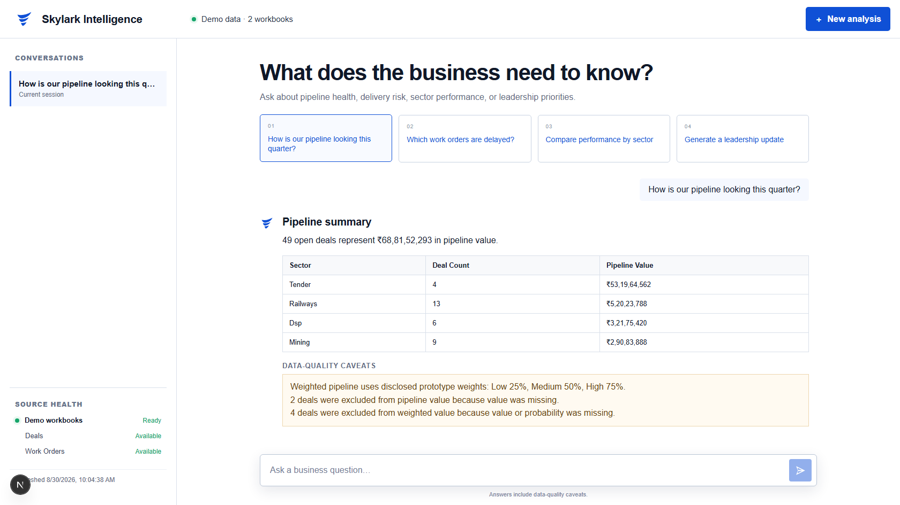
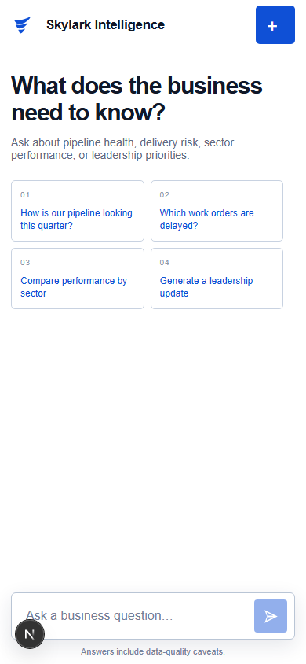
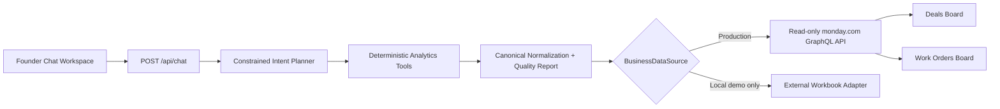

<div align="center">

# Skylark Intelligence

### Founder-facing business intelligence across monday.com Deals and Work Orders

[](https://skylark-intelligence-kohl.vercel.app/)
[](https://nextjs.org/)
[](https://www.typescriptlang.org/)
[](https://monday.com/)

[**Open Live Prototype**](https://skylark-intelligence-kohl.vercel.app/) · [**Decision Log**](docs/DECISION_LOG.md) · [**Source Repository**](https://github.com/Kalyan-4406/skylark-intelligence1)

</div>

---

## Overview

Skylark Intelligence is a conversational business-intelligence agent built for founders and executives. It dynamically reads separate Deals and Work Orders boards from monday.com, normalizes real-world messy data, runs deterministic analysis, and presents decision-ready answers with explicit data-quality caveats.

The language model is used only for constrained intent planning. It does not calculate metrics or generate arbitrary GraphQL. Filtering, arithmetic, exclusions, cross-board linkage, and leadership summaries are performed by tested TypeScript tools.

## Product Preview

<table>
  <tr>
    <td width="72%" align="center">
      
    </td>
    <td width="28%" align="center">
      
    </td>
  </tr>
  <tr>
    <td align="center"><strong>Desktop workspace</strong></td>
    <td align="center"><strong>Mobile layout</strong></td>
  </tr>
</table>

## Assignment Coverage

| Requirement | Implementation |
| --- | --- |
| **Monday.com integration** | Read-only, versioned GraphQL API with cursor pagination across Deals and Work Orders boards. |
| **Data resilience** | Normalizes inconsistent dates, numbers, names, statuses, probabilities, and null values without fabricating data. |
| **Query understanding** | OpenAI selects from a constrained tool schema; a deterministic router provides fallback behavior and focused clarification prompts. |
| **Business intelligence** | Pipeline, sector, owner, delivery, billing, collections, receivables, and cross-board analysis. |
| **Leadership updates** | On-demand Markdown brief with an executive summary, highlights, delivery risks, caveats, and follow-ups. |
| **Graceful failure handling** | Authentication, network, GraphQL, rate-limit, configuration, and analysis failures return safe messages without secrets or upstream bodies. |

## Key Capabilities

- **Pipeline intelligence:** open-deal volume, value, weighted value, stage, status, sector, and owner views.
- **Operational intelligence:** delayed work orders, execution status, billing, collections, and receivables.
- **Cross-board analysis:** exact normalized deal-name linkage with matched and unmatched counts.
- **Data-quality reporting:** affected records are excluded only from calculations that require unusable fields.
- **Conversational clarification:** ambiguous questions are narrowed to pipeline, delivery, or combined analysis.
- **Leadership preparation:** concise updates generated from the current board snapshot.

### Example Questions

```text
How is our energy-sector pipeline looking?
Which work orders are delayed?
Compare deals with their linked work orders.
Show receivables and collections by sector.
Generate a leadership update.
```

## Architecture



### Request Flow

1. The API validates the conversation payload and enforces message limits.
2. OpenAI or the deterministic fallback router selects an allowed analysis tool.
3. The selected data source loads a fresh canonical business snapshot.
4. Deterministic analytics calculate the requested metrics and exclusions.
5. The response returns Markdown evidence, caveats, source mode, and freshness metadata.

## Technology Stack

| Layer | Technology | Rationale |
| --- | --- | --- |
| Application | Next.js App Router + React | One deployable artifact for UI, API routes, and server-only secrets. |
| Language | TypeScript | Shared types across configuration, normalization, analytics, and responses. |
| Validation | Zod | Runtime validation for environment variables, API payloads, and planner output. |
| Monday integration | Versioned GraphQL API | Dynamic, read-only board access without synchronized storage. |
| AI planning | OpenAI Responses API | Constrained intent selection; deterministic fallback remains available. |
| Spreadsheet demo | `read-excel-file` | Explicit local evaluation path using external workbooks. |
| Testing | Vitest, Testing Library, Playwright | Unit, integration, component, responsive, and end-to-end coverage. |
| Hosting | Vercel | Native Next.js build and serverless runtime support. |

## Getting Started

### Prerequisites

- Node.js `20.9` or newer.
- A monday.com API token with read access to both boards.
- Deals and Work Orders board IDs.
- Optional OpenAI API key. The deterministic router works without one.

### 1. Clone and Install

```bash
git clone https://github.com/Kalyan-4406/skylark-intelligence1.git
cd skylark-intelligence1
npm install
```

### 2. Configure monday.com Boards

1. Create separate `Deals` and `Work Orders` boards.
2. Import `Deal funnel Data.xlsx` into Deals and use `Deal Name` as the item-name column.
3. Import `Work_Order_Tracker Data.xlsx` into Work Orders. Its actual header is the second spreadsheet row; use `Deal name masked` as the item-name column.
4. Preserve remaining spreadsheet headers as monday.com column titles.
5. Use Date columns for dates, Numbers for amounts, Status or Text for status fields, and Text for identifiers.
6. Copy both board IDs from their monday.com URLs or the API playground.

The adapter maps fields by visible column title because generated monday.com column IDs are workspace-specific. Unknown columns are ignored; missing expected columns become reported quality limitations.

### 3. Configure Environment Variables

Copy `.env.example` to `.env.local`:

```dotenv
DATA_SOURCE=monday
MONDAY_API_TOKEN=your_token
MONDAY_DEALS_BOARD_ID=123456789
MONDAY_WORK_ORDERS_BOARD_ID=987654321
OPENAI_API_KEY=your_optional_key
OPENAI_MODEL=gpt-5-mini
BUSINESS_TIMEZONE=Asia/Kolkata
```

| Variable | Required | Purpose |
| --- | --- | --- |
| `DATA_SOURCE` | Yes | Use `monday` for production or `demo` for explicit local workbook mode. |
| `MONDAY_API_TOKEN` | Monday mode | Read-only monday.com API authentication. |
| `MONDAY_DEALS_BOARD_ID` | Monday mode | Deals board identifier. |
| `MONDAY_WORK_ORDERS_BOARD_ID` | Monday mode | Work Orders board identifier. |
| `OPENAI_API_KEY` | No | Enables model-assisted intent planning. |
| `OPENAI_MODEL` | No | Defaults to `gpt-5-mini`. |
| `BUSINESS_TIMEZONE` | No | Defaults to `Asia/Kolkata`. |

Never commit `.env.local`, API tokens, Vercel metadata, or workbook exports.

### 4. Run Locally

```bash
npm run dev
```

Open [http://localhost:3000](http://localhost:3000). Safe configuration readiness is available at `/api/health`.

## Data Source Modes

### Production: monday.com

```dotenv
DATA_SOURCE=monday
```

Production always queries monday.com dynamically using GraphQL API version `2026-07`. It performs no mutations and does not bundle spreadsheet records.

### Local Evaluation: Workbooks

```dotenv
DATA_SOURCE=demo
DEMO_DEALS_FILE=Deal funnel Data.xlsx
DEMO_WORK_ORDERS_FILE=Work_Order_Tracker Data.xlsx
```

Demo mode is explicit and visibly labeled. Workbook files remain ignored by Git and outside production deployments.

## Verification

```bash
npm test
npm run typecheck
npm run lint
npm run build
npm run test:e2e
npm audit --omit=dev
```

| Gate | Coverage |
| --- | --- |
| Unit and integration tests | Configuration, normalization, Monday transport/mapping, analytics, routing, and safe API failures. |
| Component tests | Prompt submission, Markdown responses, source state, and error recovery. |
| End-to-end test | Pipeline and leadership workflows across desktop and mobile layouts. |
| Build and lint | Next.js production build, strict TypeScript, and ESLint. |
| Dependency audit | Production dependency vulnerability scan. |

The E2E suite runs in explicit workbook demo mode. Unit tests use synthetic records rather than hardcoded assignment data.

## Deployment

The verified production deployment is available at:

### [skylark-intelligence-kohl.vercel.app](https://skylark-intelligence-kohl.vercel.app/)

To create a new Vercel deployment:

1. Import this repository into Vercel or run `vercel link`.
2. Add production and preview environment variables with `DATA_SOURCE=monday`.
3. Mark the Monday and OpenAI tokens as sensitive.
4. Deploy a preview and verify `/api/health`, pipeline, work-order, linkage, and leadership prompts.
5. Confirm `/api/health` reports `dataSource: "monday"`.
6. Promote the verified preview to production.

## Security and Failure Handling

- Monday access is read-only; the application defines no mutation path.
- Secrets are read only on the server and are never returned by `/api/health`.
- Logs record sanitized error categories instead of tokens, messages, or upstream bodies.
- Invalid requests and upstream failures return generic, user-safe responses.
- Negative or suspicious source values remain visible and are flagged instead of silently corrected.
- Cross-board analysis avoids fuzzy guesses and discloses unmatched records.

## Known Limitations

- The boards do not share an immutable deal ID, so linkage uses exact deal-name equality after trimming and case normalization.
- Visible column titles provide portability but require mapping updates after board-column renames.
- Quarter wording currently resolves to the available open-pipeline view rather than a configurable fiscal calendar.
- The prototype does not include scheduled reports, presentation export, per-user authentication, or long-term snapshot storage.

## Repository Structure

```text
app/                  Next.js pages and API routes
components/chat/      Conversational workspace components
lib/agent/            Intent planning, routing, and response formatting
lib/analytics/        Deterministic BI calculations and leadership updates
lib/domain/           Canonical models, normalization, and quality metadata
lib/monday/           Read-only GraphQL transport, pagination, and mapping
lib/demo/             Explicit local workbook adapter
tests/                Unit, integration, route, and component tests
e2e/                  Browser workflow and responsive verification
docs/                 Decision log, design artifacts, and verification evidence
```

## Assignment Deliverables

| Deliverable | Location |
| --- | --- |
| Hosted prototype | [skylark-intelligence-kohl.vercel.app](https://skylark-intelligence-kohl.vercel.app/) |
| Decision Log | [`docs/DECISION_LOG.md`](docs/DECISION_LOG.md) |
| Architecture and setup | This README |
| Source repository | [Kalyan-4406/skylark-intelligence1](https://github.com/Kalyan-4406/skylark-intelligence1) |
| Source archive | Generated locally as `Skylark-Intelligence-Submission.zip` |

The submission archive is intentionally not committed. Generate it from tracked source after verification. Exclude `.git`, `.env.local`, dependencies, build output, test output, workbooks, Vercel metadata, and credentials.

## Decision Log

Key assumptions, architecture trade-offs, data-cleaning rules, cross-board linkage choices, leadership-update interpretation, and future improvements are documented in [`docs/DECISION_LOG.md`](docs/DECISION_LOG.md).

---

<div align="center">

Built as a read-only Monday.com Business Intelligence Agent assignment.

[Live Prototype](https://skylark-intelligence-kohl.vercel.app/) · [Decision Log](docs/DECISION_LOG.md) · [Repository](https://github.com/Kalyan-4406/skylark-intelligence1)

</div>
